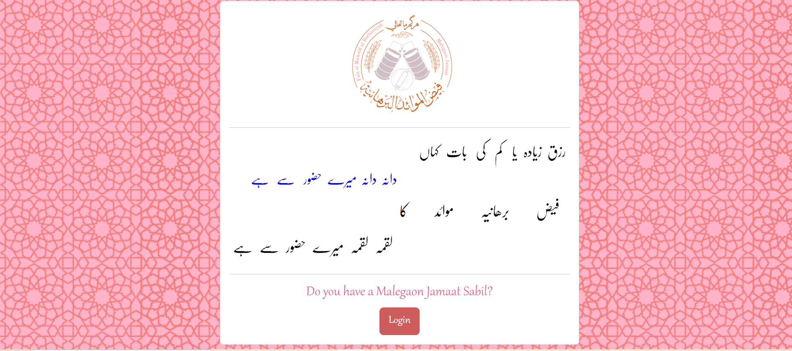

# Mustansir's Portfolio


Personal portfolio website for Mustansir Sabir, a Software Engineer specializing in full-stack .NET development, performance optimization, enterprise security, and practical AI tooling.

The site is built as a responsive React and Vite experience with a pixel-inspired RetroUI visual system, a project showcase, achievements, contact form, and a dedicated Mustansir AI assistant.

## Live Experience

- Portfolio home: `/`
- AI assistant: `/assistant`
- GitHub: [mustansirsabir68/Mustansir-s-portfolio](https://github.com/mustansirsabir68/Mustansir-s-portfolio)
- LinkedIn: [Mustansir Sabir](https://www.linkedin.com/in/mustansir-sabir-139495206)

## Highlights

- Responsive portfolio layout for desktop, tablet, and mobile
- RetroUI pixel cards, buttons, borders, and offset shadows
- Warm ivory, aubergine, coral, mint, and teal visual palette
- Hero section with animated role text and social links
- Skills grouped into development, performance, and security disciplines
- Project carousel with explicit previous/next navigation
- Project metadata, technology chips, demos, and source links
- Achievement metrics with animated counters
- About section and responsive contact form
- Mustansir AI chat route with day/night mode
- Resume match analysis workflow for job descriptions
- Accessible labels, focus states, and responsive controls

## Screenshots

### Portfolio hero


### FMB Malegaon project



### Portfolio project preview


## Technology

- React 18
- Vite
- React Router
- React Slick
- Axios
- React CountUp
- React Intersection Observer
- WOW.js
- LineIcons
- RetroUI via `pixel-retroui`
- CSS with responsive layout utilities and custom design tokens

## Project Structure

```text
src/
  App.jsx                         Application routes and loading state
  main.jsx                        React entry point and global styles
  your_info.jsx                   Portfolio content and profile configuration
  assets/
    css/                          Global and vendor styles
    images/                       Portfolio and project media
  components/
    1. Header Components/         Hero, navbar, and typewriter
    2. Content Components/        Skills, achievements, and projects
    3. Footer Components/         About and contact sections
    4. Utility Components/        Assistant, loader, and scroll controls
```

## Getting Started

### Prerequisites

- Node.js 18 or newer
- npm

### Install

```bash
git clone https://github.com/mustansirsabir68/Mustansir-s-portfolio.git
cd Mustansir-s-portfolio
npm install
```

### Run locally

```bash
npm run dev
```

Open the local Vite URL shown in the terminal.

### Production build

```bash
npm run build
```

### Preview the production build

```bash
npm run preview
```

## Configuration

Most portfolio content can be changed in [src/your_info.jsx](src/your_info.jsx):

- Name and resume URL
- Typewriter messages
- Social profile links
- Skill categories
- Achievement metrics
- Project titles, descriptions, previews, technologies, and source links
- About text and slogan
- Contact service configuration

The global RetroUI-inspired design tokens are defined in [src/assets/css/main.css](src/assets/css/main.css). Component-specific styles live alongside their React components.

## Contact Form

The contact form currently posts to:

```text
https://mustansir-llm-api.onrender.com/send
```

The form uses the hosted Render API. Without the backend or allowed CORS origin, the UI displays the existing error state without breaking the portfolio.

## Mustansir AI

The assistant route provides:

- Portfolio and career questions through `/predict`
- Resume match analysis through `/match`
- New chat reset
- Responsive desktop sidebar and mobile chat layout
- Day/night theme toggle persisted in local storage

The assistant backend is expected at:

```text
https://mustansir-llm-api.onrender.com/predict
https://mustansir-llm-api.onrender.com/match
```

## Vercel Deployment

Import the GitHub repository into Vercel with the Vite framework preset. Vercel detects these settings automatically:

```text
Build command: npm run build
Output directory: dist
Install command: npm install
```

The included `vercel.json` rewrite keeps React Router routes such as `/assistant` working on direct visits.

For legacy GitHub Pages deployment, the project includes:

```bash
npm run deploy
```


## License

This project is available under the MIT License. See [LICENSE](LICENSE) for details.
